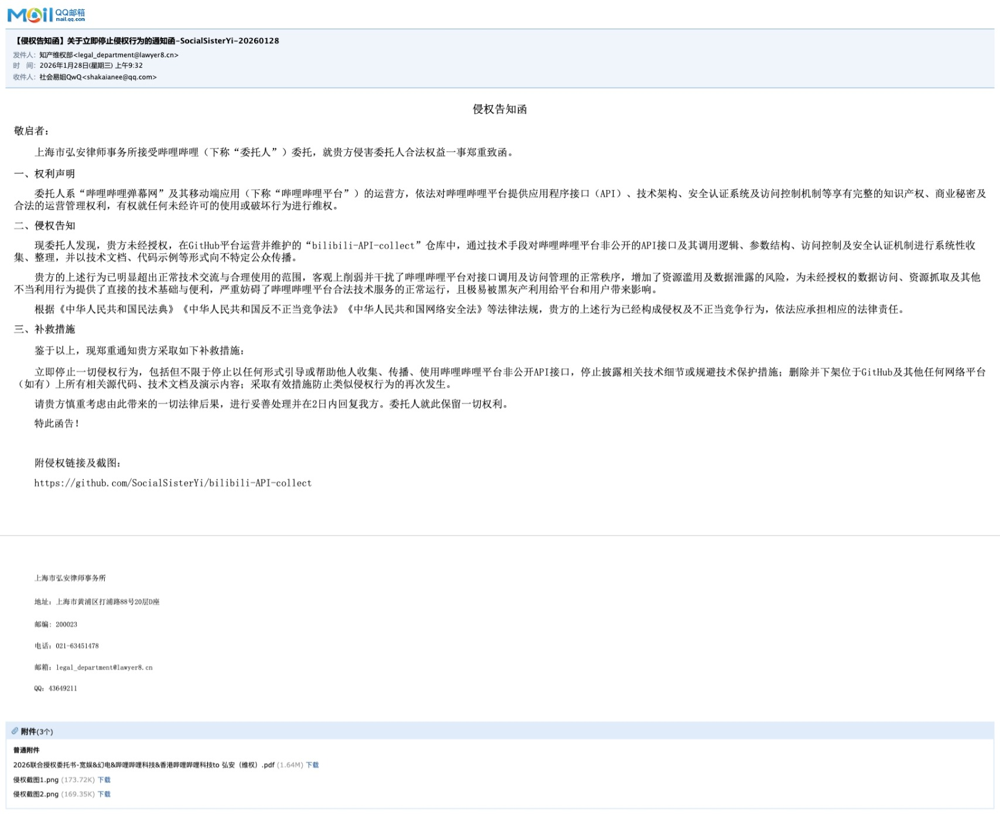

# Deprecated

本仓库停止维护并永久永久关停。

This Repo will cease maintenance and be permanently closed.

## 原因

2026年1月28日，本仓库维护者收到B站委托的律师事务所发律师函警告邮件，指控本仓库中的项目存在“通过技术手段对哔哩哔哩平台非公开的API接口及其调用逻辑、参数结构、访问控制及安全认证机制进行系统性收集、整理，并以技术文档、代码示例等形式向不特定公众传播”的侵权行为。

即日起停止维护并删除相关文档及源代码。

