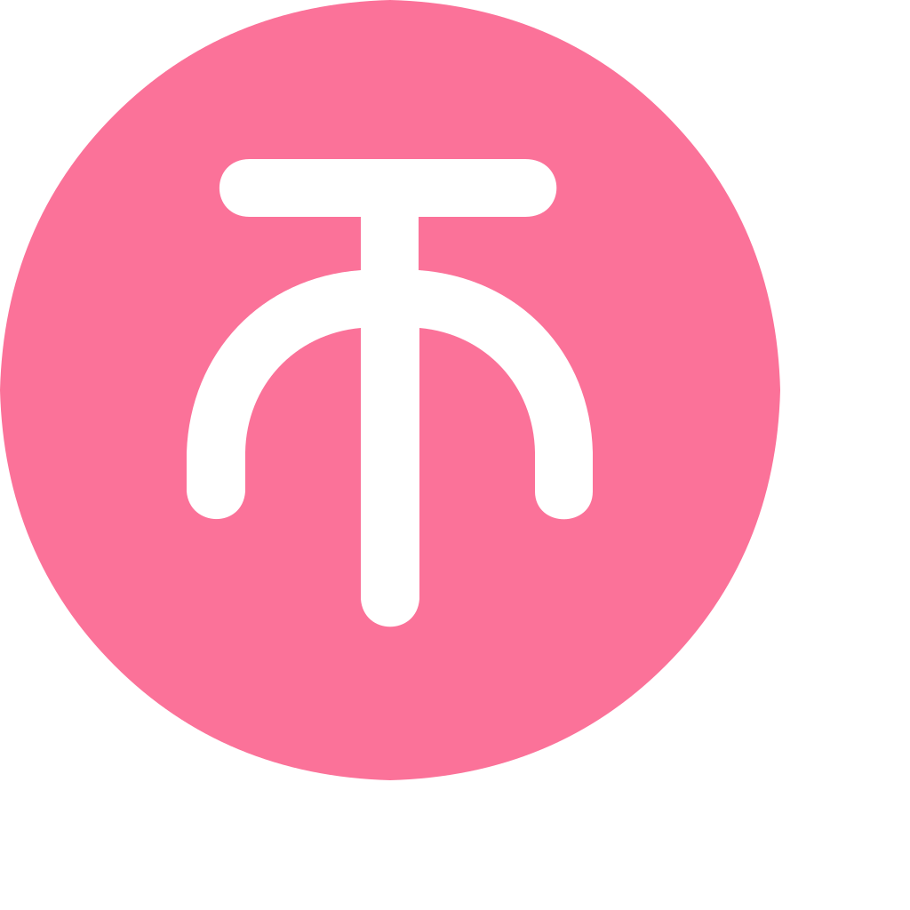

# 专栏点赞&投币&收藏

## 点赞文章


> https://api.bilibili.com/x/article/like

*请求方式：POST*

认证方式：Cookie（SESSDATA）

**正文参数（ application/x-www-form-urlencoded ）：**

| 参数名 | 类型 | 内容                | 必要性 | 备注                   |
| ------ | ---- | ------------------- | ------ | ---------------------- |
| id     | num  | 文章cvid            | 必要   |                        |
| type   | num  | 操作方式            | 必要   | 1：点赞<br />2：取消赞 |
| csrf   | str  | CSRF Token（位于cookie） | 必要   |                        |

**json回复：**

根对象：

| 字段    | 类型 | 内容     | 备注                                                         |
| ------- | ---- | -------- | ------------------------------------------------------------ |
| code    | num  | 返回值   | 0：成功 <br />-101：账号未登录<br />-111：csrf校验失败<br />-400：请求错误<br />10003：不存在该稿件<br />65006：已赞过<br />65004：取消点赞失败 |
| message | str  | 错误信息 | 默认为0                                                      |
| ttl     | num  | 1        |                                                              |

**示例：**

为文章`cv5806746`点赞

```shell
curl 'https://api.bilibili.com/x/article/like' \
--data-urlencode 'id=5806746' \
--data-urlencode 'type=1' \
--data-urlencode 'csrf=xxx' \
-b 'SESSDATA=xxx'
```

<details>
<summary>查看响应示例：</summary>

```json
{
    "code": 0,
    "message": "0",
    "ttl": 1
}
```

</details>

## 投币文章



> https://api.bilibili.com/x/web-interface/coin/add

*请求方式：POST*

认证方式：Cookie（SESSDATA）

**正文参数（ application/x-www-form-urlencoded ）：**

| 参数名   | 类型 | 内容                | 必要性 | 备注    |
| -------- | ---- | ------------------- | ------ | ------- |
| aid      | num  | 文章cvid            | 必要   |         |
| upid     | num  | 文章作者mid         | 必要   |         |
| multiply | num  | 投币数量            | 必要   | 上限为2 |
| avtype | num | 2 | 必要 | 必须为2 |
| csrf     | str  | CSRF Token（位于cookie） | 必要   |         |

**json回复：**

根对象：

| 字段    | 类型 | 内容     | 备注                                                         |
| ------- | ---- | -------- | ------------------------------------------------------------ |
| code    | num  | 返回值   | 0：成功<br />-101：账号未登录<br />-102：账号被封停<br />-104：硬币不足<br />-111：csrf校验失败<br />-400：请求错误<br />10003：不存在该稿件<br />34002：不能给自己投币<br />34003：非法的投币数量<br />34005：超过投币上限 |
| message | str  | 错误信息 | 默认为0                                                      |
| ttl     | num  | 1        |                                                              |
| data    | obj  | 信息本体 |                                                              |

data 对象：

| 字段 | 类型 | 内容         | 备注                                                  |
| ---- | ---- | ------------ | ----------------------------------------------------- |
| like | bool | 是否点赞成功 | true：成功<br />false：失败<br />已赞过则附加点赞失败 |

**示例：**

为文章`cv5806746`投币1枚

```shell
curl 'https://api.bilibili.com/x/web-interface/coin/add' \
--data-urlencode 'aid=5806746' \
--data-urlencode 'upid=486980924' \
--data-urlencode 'multiply=1' \
--data-urlencode 'avtype=2' \
--data-urlencode 'csrf=xxx' \
-b 'SESSDATA=xxx'
```

<details>
<summary>查看响应示例：</summary>

```json
{
    "code": 0,
    "message": "0",
    "ttl": 1,
    "data": {
        "like": false
    }
}
```

</details>

## 收藏文章


>https://api.bilibili.com/x/article/favorites/add

*请求方式：POST*

认证方式：Cookie（SESSDATA）

**正文参数（ application/x-www-form-urlencoded ）：**

| 参数名 | 类型 | 内容                | 必要性 | 备注 |
| ------ | ---- | ------------------- | ------ | ---- |
| id     | num  | 文章cvid            | 必要   |      |
| csrf   | str  | CSRF Token（位于cookie） | 必要   |      |

**json回复：**

根对象：

| 字段    | 类型 | 内容     | 备注                                                         |
| ------- | ---- | -------- | ------------------------------------------------------------ |
| code    | num  | 返回值   | 0：成功<br />-101：账号未登录<br />-111：csrf校验失败<br />-400：请求错误<br />-404：无此项 |
| message | str  | 错误信息 | 正确为success                                                |
| data    | obj  | 信息本体 |                                                              |

**示例：**

收藏文章`cv5806746`

```shell
curl 'https://api.bilibili.com/x/article/favorites/add' \
--data-urlencode 'id=5806746' \
--data-urlencode 'csrf=xxx' \
-b 'SESSDATA=xxx'
```

<details>
<summary>查看响应示例：</summary>

```json
{
    "code": 0,
    "message": "0",
    "ttl": 1
}
```

</details>
