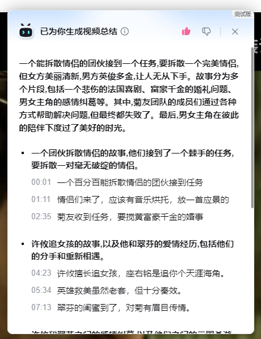

# AI视频总结接口


*接口：*

> https://api.bilibili.com/x/web-interface/view/conclusion/get

*请求方式：GET*

认证方式：仅可Cookie（SESSDATA）

**正文参数：**

| 参数名          | 类型  | 内容      | 必要性 | 备注                                                        |
|--------------|-----|---------|-----|-----------------------------------------------------------|
| bvid         | str | bv号     | 必要  | 用于指定视频                                                    |
| cid          | num | cid     | 必要  | 用于指定分P                                                    |
| up_mid       | num | UP主的mid | 必要  | 无                                                         |
| web_location | num | 不知道干嘛的  | 必要  | 在视频页面源码中"name"为"spm_prefix"的<br/>meta标签中的"content"属性即为该参数 |
| w_rid        | str | 签名      | 必要  | 查看wbi签名章节                                                 |
| wts          | num | 时间戳     | 必要  | 精确到秒                                                      |

**Json回复：**

根节点：

| 字段      | 类型     | 内容   | 备注                                 |
|---------|--------|------|------------------------------------|
| code    | num    | 返回值  | 0: 成功 <br/>-403: 无权限 (所有的错误都返回这个值) |
| message | string | 错误提示 | 所有的错误提示都是无权限，可以忽略                  |
| ttl     | num    | 1    | 未知作用                               |
| data    | object | 数据内容 |                                    |

data节点:

| 字段           | 类型     | 内容      | 备注              |
|--------------|--------|---------|-----------------|
| code         | num    | 0       |                 |
| dislike_num  | num    | 点踩人数    | ↓               |
| like_num     | num    | 点赞人数    | ps.这两个参数在网页上不显示 |
| model_result | object | 视频总结的内容 |                 |
| status       | num    | 0       | 未知作用            |
| stid         | str    | 一串字符串数字 | 应该是这篇文章的唯一id    |

model_result节点：

内容过多，请看VCR ↓




```json
{
  "result_type": 2,
  "summary": "一个能拆散情侣的团伙接到一个任务,要拆散一个完美情侣,但女方美丽清新,男方英俊多金,让人无从下手。故事分为多个片段,包括一个悲伤的法国喜剧、富豪千金的婚礼问题、男女主角的感情纠葛等。其中,菊友团队的成员们通过各种方式帮助解决问题,但最终都失败了。最后,男女主角在彼此的陪伴下度过了美好的时光。",
  "outline": [
    {
      "title": "一个团伙拆散情侣的故事,他们接到了一个棘手的任务,要拆散一对毫无破绽的情侣。",
      "part_outline": [
        {
          "timestamp": 1,
          "content": "一个百分百能拆散情侣的团伙接到任务"
        },
        {
          "timestamp": 71,
          "content": "情侣们来了，应该有音乐烘托，放一首应景的"
        },
        {
          "timestamp": 155,
          "content": "菊友收到任务，要搅黄富豪千金的婚事"
        }
      ],
      "timestamp": 1
    },
    {
      "title": "许攸追女孩的故事,以及他和翠芬的爱情经历,包括他们的分手和重新相遇。",
      "part_outline": [
        {
          "timestamp": 263,
          "content": "许攸擅长追女孩，座右铭是追你个天涯海角。"
        },
        {
          "timestamp": 334,
          "content": "英雄救美虽然老套，但十分奏效。"
        },
        {
          "timestamp": 433,
          "content": "翠芬的闺蜜到了，对菊有眉目传情。"
        }
      ],
      "timestamp": 263
    },
    {
      "title": "许攸和翠芬之间的感情纠葛,以及他们之间的三国杀游戏。",
      "part_outline": [
        {
          "timestamp": 531,
          "content": "许攸在翠芬和菊优眼中的身份转变"
        },
        {
          "timestamp": 598,
          "content": "许攸处理高利贷和翠芬去拉斯维加斯结婚的问题"
        },
        {
          "timestamp": 716,
          "content": "焗油带翠芬出去走走，准备了一个苦练已久的节目"
        }
      ],
      "timestamp": 531
    },
    {
      "title": "一个女孩的爱情故事,父亲的干预,以及推荐了一款男士洁面乳和洗发水。",
      "part_outline": [
        {
          "timestamp": 798,
          "content": "翠芬聊起自己的过去，想向父亲证明自己可以拥有美好的婚姻"
        },
        {
          "timestamp": 862,
          "content": "GEO团队准备转行，杰克许攸很清楚他不配选择这份爱情"
        },
        {
          "timestamp": 992,
          "content": "西木源男士控油洁面乳能深层清理毛孔油脂污垢，不伤皮肤"
        }
      ],
      "timestamp": 798
    }
  ]
}
```

**Python Demo**

```python
import requests

headers = {
    # 需要附带上Cookie等信息
    'user-agent': 'Mozilla/5.0 (Windows NT 10.0; Win64; x64) AppleWebKit/537.36 (KHTML, like Gecko) Chrome/119.0.0.0 Safari/537.36',
}

params = {
    'bvid': 'BV1d94y1375U',
    'cid': '1334003541',
    'up_mid': '407275913',
    'web_location': '333.788',  # 视频页面源码某个meta标签
    'w_rid': '5cafe844afcb813ecd129f08e6ea73b5',  # 参见Wbi签名章节
    'wts': '1700579155',
}

response = requests.get(
    'https://api.bilibili.com/x/web-interface/view/conclusion/get',
    params=params,
    headers=headers,
)
```